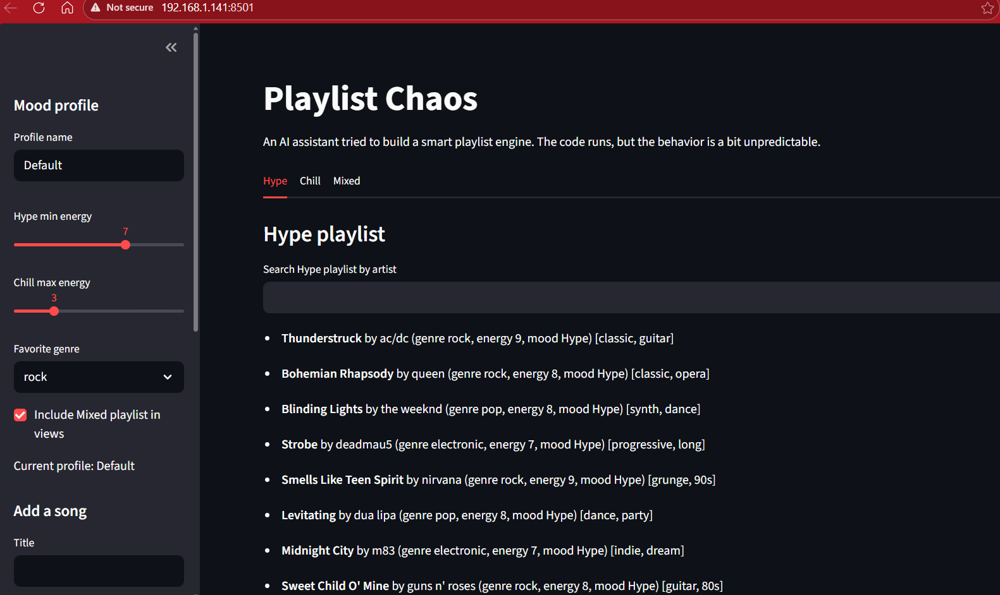
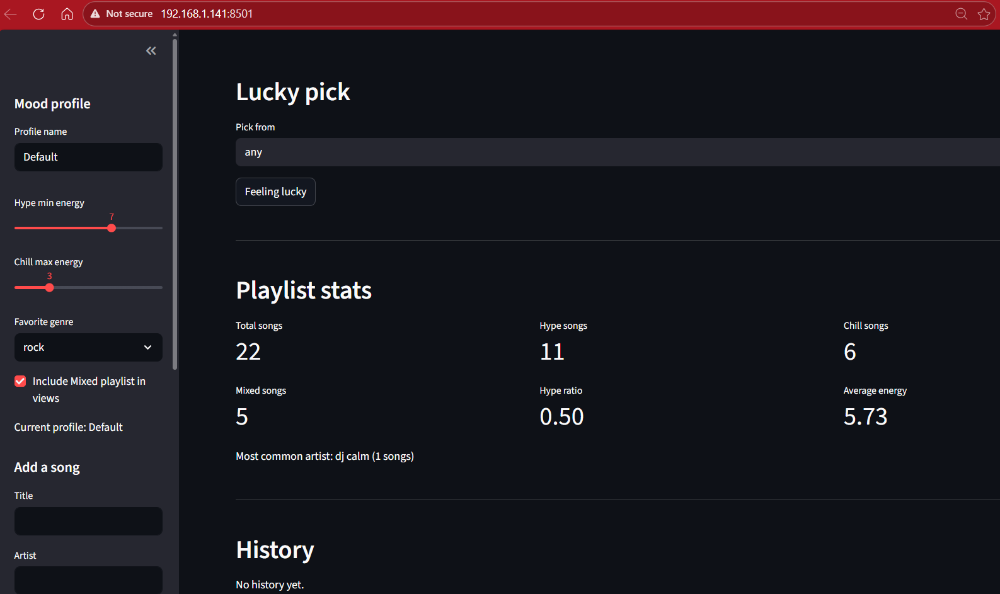

## README Outline – Playlist Chaos (Lab Submission)

### 1. Project Overview

This project focused on debugging and improving an AI-generated Streamlit playlist application that categorizes songs into Hype, Chill, and Mixed playlists based on user-defined mood settings. The objective was to investigate inconsistent behavior, identify logic flaws in the underlying Python code, implement targeted fixes, and validate improvements through systematic testing. The lab emphasized structured debugging, disciplined use of AI assistance, and maintaining clean version control throughout the process.

---

### 2. Summary of Fixes

#### Fix 1 – Search Logic Reversed

**Issue Observed:**
Search results were inconsistent, and partial matches like typing “ac” did not reliably return “AC/DC.”

**Root Cause:**
The search function checked whether the full artist value existed inside the query string instead of checking whether the query string existed inside the artist value.

**Solution Implemented:**
Reversed the containment logic to `if q in value`, ensuring proper case-insensitive partial matching aligned with expected search behavior.

**How I Tested It:**
Tested multiple partial searches (e.g., “ac”, “queen”, “dav”) across different playlists and confirmed all appropriate songs appeared correctly.

---

#### Fix 2 – Incorrect Playlist Statistics Calculations

**Issue Observed:**
Hype ratio and average energy values were inaccurate and did not reflect all songs in the system.

**Root Cause:**
The calculation incorrectly used only Hype songs when computing totals and energy averages, causing inflated ratios and misleading averages.

**Solution Implemented:**
Updated the statistics function to calculate totals and averages using all songs across all playlists and corrected the hype ratio denominator.

**How I Tested It:**
Manually verified song counts and energy averages using small controlled datasets and confirmed that displayed metrics matched expected mathematical results.

---

#### Fix 3 – Lucky Pick Crash on Empty Playlists

**Issue Observed:**
Selecting Lucky Pick when a playlist was empty caused the app to crash instead of displaying a warning.

**Root Cause:**
The random selection function attempted to choose from an empty list without checking if songs were available.

**Solution Implemented:**
Added a guard clause to return `None` when the playlist is empty, allowing the UI to display a warning instead of raising an exception.

**How I Tested It:**
Cleared songs and attempted Lucky Pick in each mode, confirming the app displayed a warning message without crashing.

---

#### Fix 4 – Case Sensitivity in Mood Classification

**Issue Observed:**
Some songs were misclassified when genre or title case did not match expected keyword casing.

**Root Cause:**
Keyword checks in the classification function were not consistently normalized to lowercase before comparison.

**Solution Implemented:**
Normalized title, genre, and favorite genre values to lowercase before evaluating keyword conditions to ensure consistent comparisons.

**How I Tested It:**
Added songs with varied capitalization (e.g., “ROCK”, “Ambient”, “Sleep Track”) and confirmed they were classified into the correct playlists.

---

### 3. Refactor Summary

**What Was Refactored:**
The `compute_playlist_stats` function was reorganized to calculate totals, ratios, and averages using a single aggregated song list with clearer variable flow.

**Why It Improved Readability/Structure:**
The logic now follows a clean sequence—collect songs, compute totals, calculate derived metrics—making the function easier to understand and maintain.

**Verification That Behavior Stayed the Same:**
After refactoring, I retested playlist counts, ratios, and averages with controlled song inputs and confirmed all outputs remained correct.

---

### 4. Application Screenshot

---

### 5. Reflection Discussion

**Issue I Chose to Fix and Why:**
I focused on fixing the statistics logic first because incorrect metrics directly impact reliability and user trust.

**How I Used AI During Debugging:**
I used AI to explain the existing logic and identify where calculations were incorrect before making focused edits.

**Where AI Was Helpful / Not Helpful:**
AI helped identify flawed math quickly but required review to avoid unnecessary structural changes.

**Testing Strategy:**
I tested each fix incrementally by adding songs, checking playlists, verifying search behavior, and manually confirming calculations.

**Key Insight About AI-Assisted Debugging:**
AI works best as a guided collaborator—clear prompts and manual validation are critical to producing accurate fixes.
